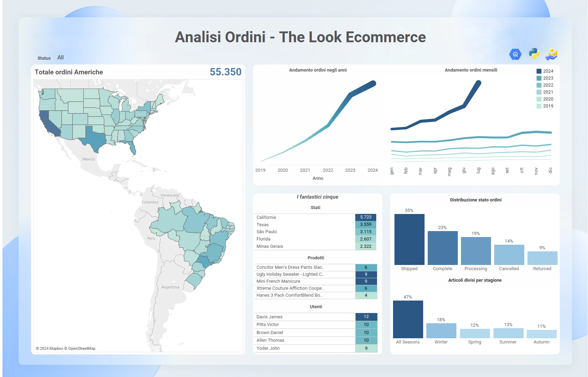

# The Look Ecommerce - Analysis of Sales and Profits in the Americas

This repository contains an analysis of the "The Look Ecommerce" dataset, focusing on the sales and profits of various products in the Americas.

## Project Overview

- **Data Source**: Extracted from Google Big Query using SQL.
- **Data Cleaning & Augmentation**: Performed with Python.
- **Visualization**: Created using Tableau.
- - **Region of Focus**: The analysis specifically targets sales and profit data within North, Central, and South America.

## Folder Structure

- `/data/`: Contains the SQL queries and cleaned dataset.
- `/dashboards/`: Screenshots of the Tableau dashboards.
- `/tableau/`: The Tableau workbook file (.twbx) for the analysis.

```
/The-Look-Ecommerce-Analysis
│
├── /data/                           # Dati grezzi e file SQL
│   ├── extraction-query.sql         # Script SQL per l'estrazione dei dati
│   └── data_augmentation.py         # Script Python per pulizia e arricchimento dati
│
├── /dashboards/                     # Immagini delle dashboard di Tableau
│   ├── profit_analysis.png          # Screenshot della dashboard sui profitti
│   └── orders_analysis.png          # Screenshot della dashboard sugli ordini
│
├── /tableau/                        # File Tableau
│   └── TLE_Analysis.twbx            # File .twbx di Tableau
│
├── README.md                        # Questo file
```
## Analysis

### Sales and Orders



This dashboard provides insights into the number of orders, product distribution, and other relevant metrics across the Americas. It highlights key regions like California, Texas, and São Paulo as leading in terms of order volume. The data also shows consistent growth in orders over recent years, with a notable spike during the winter months. Additionally, the analysis of order status reveals that 35% of the orders have already been shipped, and there is a strong preference for seasonal products, particularly in winter

### Profit Analysis


This dashboard visualizes the profits generated by various products across different regions in the Americas. The profit map indicates that regions like California, Texas, and São Paulo are top contributors. The data further projects strong profit growth in the coming months, with marked peaks in the summer and winter seasons.

One of the key insights from this analysis is that winter products have a significantly higher average spending compared to other seasonal categories. This is largely due to the higher price markup on winter apparel and accessories. This insight is crucial for crafting targeted promotional campaigns, as discounts on high-margin winter products could be an effective strategy to boost sales during the colder months.

## How to Use

1. **SQL Query**: The [extraction-query.sql ](./data/extraction-query.sql) file can be used to extract the necessary data from Google Big Query.
2. **Python Scripts**: Use the [data_augmentation.py](./data/data_augmentation.py) script to clean and augment the data.
3. **Tableau Workbook**: Open the [TLE_Analysis.twbx](./tableau/) file in Tableau to view and interact with the visualizations.

## Requirements

- **Python**: 3.8 or higher
- **Libraries**: pandas, numpy, etc.
- **Tableau**: Version 2021.2 or higher
- **Google BigQuery Access**: Required to run the SQL extraction script


## Conclusion

Key Insight: One of the most significant findings from the analysis is that the "Winter" category products have a higher average spending compared to other seasons. This is due to the higher price markup on winter items such as clothing and cold-weather accessories. This insight is crucial for planning targeted promotional campaigns, as it presents an opportunity to maximize profits by offering strategic discounts on these products during the colder seasons.
