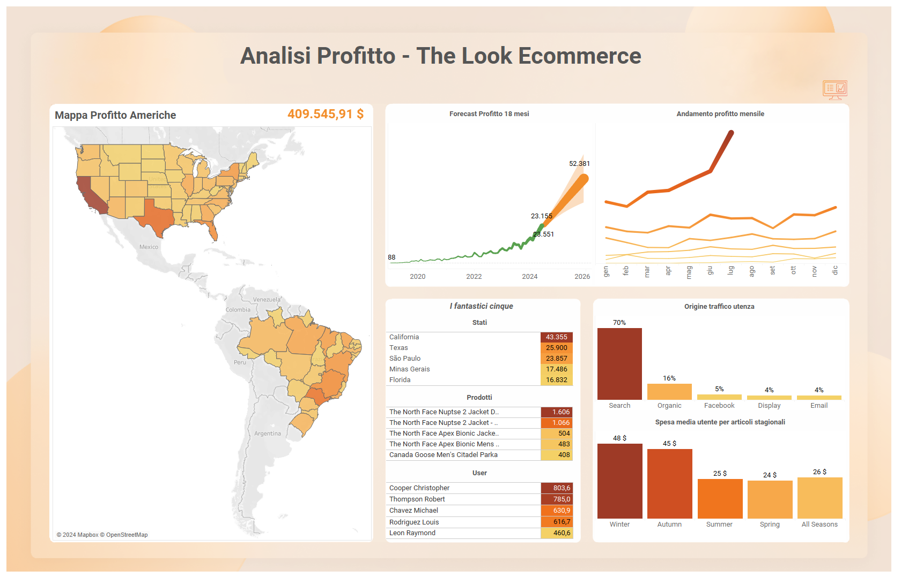

# The Look Ecommerce - Analysis of Sales and Profits

This repository contains an analysis of the "The Look Ecommerce" dataset, focusing on the sales and profits of various products.

## Project Overview

- **Data Source**: Extracted from Google Big Query using SQL.
- **Data Cleaning & Augmentation**: Performed with Python.
- **Visualization**: Created using Tableau.

## Folder Structure

- `/data/`: Contains the SQL queries and cleaned dataset.
- `/dashboards/`: Screenshots of the Tableau dashboards.
- `/tableau/`: The Tableau workbook file (.twbx) for the analysis.

```
/The-Look-Ecommerce-Analysis
│
├── /data/                           # Dati grezzi e file SQL
│   ├── extraction-query.sql         # Script SQL per l'estrazione dei dati
│   └── data_augmentation.py         # Script Python per pulizia e arricchimento dati
│
├── /dashboards/                     # Immagini delle dashboard di Tableau
│   ├── profit_analysis.png          # Screenshot della dashboard sui profitti
│   └── orders_analysis.png          # Screenshot della dashboard sugli ordini
│
├── /tableau/                        # File Tableau
│   └── TLE_Analysis.twbx            # File .twbx di Tableau
│
├── README.md                        # Questo file
└── requirements.txt                 # Librerie Python necessarie
```
## Analysis

### Sales and Orders


This dashboard provides insights into the number of orders, product distribution, and other relevant metrics.

### Profit Analysis



This dashboard visualizes the profits generated by various products across different regions.

## How to Use

1. **SQL Query**: The  file can be used to extract the necessary data from Google Big Query.
2. **Python Scripts**: Use the `data_augmentation.py` script to clean and augment the data.
3. **Tableau Workbook**: Open the `analysis.twbx` file in Tableau to view and interact with the visualizations.

## Conclusion

This project showcases the end-to-end process of data extraction, transformation, and visualization, offering valuable insights into the ecommerce performance of "The Look".
